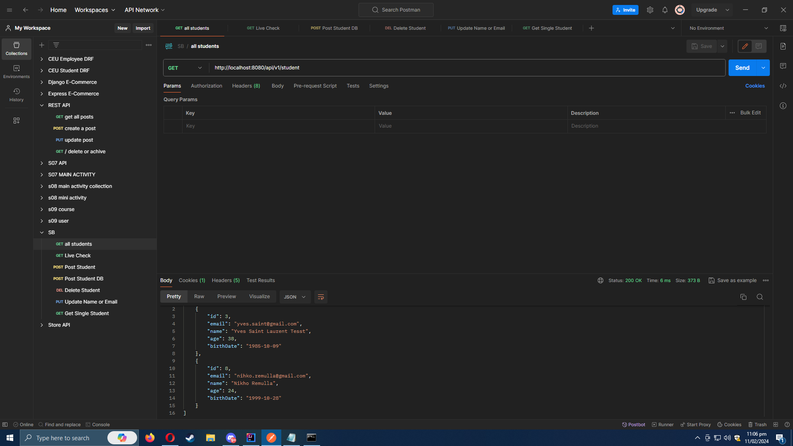
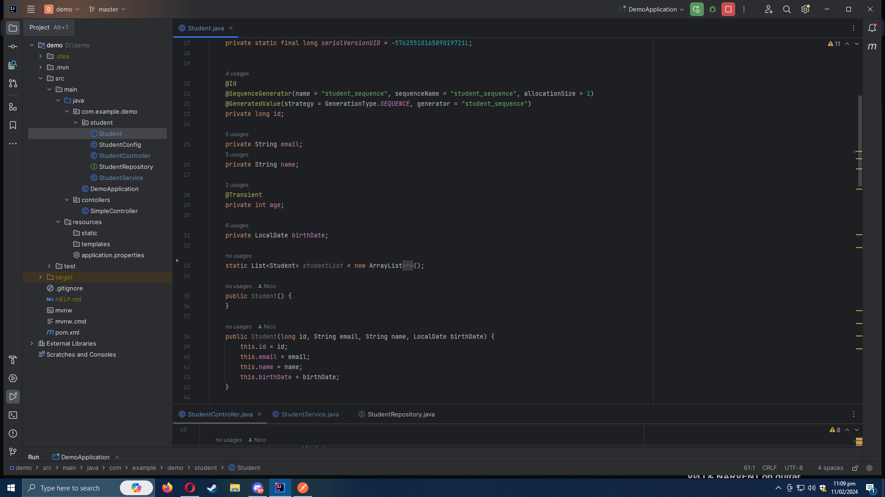

<!-- TABLE OF CONTENTS -->

  
Table of Contents

  <ol>
    <li>
      <a href="#about-the-project">About The Project</a>
      <ul>
        <li><a href="#built-with">Built With</a></li>
      </ul>
    </li>
    <li>
      <a href="#getting-started">Getting Started</a>
      <ul>
        <li><a href="#prerequisites">Prerequisites</a></li>
        <li><a href="#installation">Installation</a></li>
      </ul>
    </li>
       <li>
      <a href="#api-routes">Routes</a>
      <ul>
           <li><a href="#api-routes">API Routes</a></li>
           <li><a href="#front-end-routes">Front-end Routes</a></li>
      </ul>
    </li>
    <li><a href="#roadmap">Roadmap</a></li>
    <li><a href="#contributing">Contributing</a></li>

  </ol>

<!-- ABOUT THE PROJECT -->
## About The Project

A RESTful student management API that is built on Springboot and PostgreSQL. Similar to [CEU Student Management ](https://github.com/neekho/CEU-Student-Management) except this one is currently does not have a front-end.

(<a href="#readme-top">back to top</a>)

### Built With

* [![Java][Java.com]][Java-url]
* [![PostgreSQL][PostgreSQL.org]][PostgreSQL-url]

(<a href="#readme-top">back to top</a>)

[product-screenshot]: images/screenshot.png

[Java.com]: https://img.shields.io/badge/java-35495E?style=for-the-badge&logo=java&logoColor=white
[Java-url]: https://www.java.com/en/

[PostgreSQL.org]: https://img.shields.io/badge/PostgreSQL-33415E?style=for-the-badge&logo=postgresql&logoColor=white
[PostgreSQL-url]: https://www.postgresql.org
